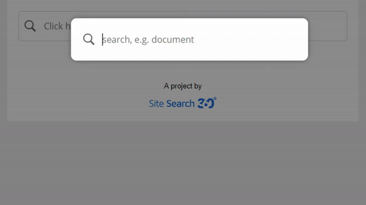

# javascript-search
Javascript Search - Serverless Superfast Search

A super fast search for one-pager with a lot of information, for example api documentations. The script is licensed under MIT, dependency free, and supported by the team at [Site Search 360](https://www.sitesearch360.com).

Try it yourself using the [demo](https://htmlpreview.github.io/?https://github.com/ddsky/javascript-search/blob/master/html/example.html)



## Install
Include the `script` and the `css` and then initialize the script to an element that triggers the search box (e.g. an element with the id "triggerBox")

```html
<link href="css/js-search.css" rel="stylesheet" type="text/css"/>
<script src="js/js-search.js"></script>
<script>
    // initialize the javascript
    JsSearch.init('triggerBox', options);

    // enable Ctrl+F shortcut
    JsSearch.enableShortcuts();
</script>
```

## Configuration
You can pass the following `options` to the `JsSearch.init`.
```js
{
    // the placeholder for the search box
    placeholder: 'Search here'
}
```

## Indexing
When calling `JsSearch.init` all elements with the class `jss-doc` will be indexed. A document can consist of the following fields

- `jss-title`: The title of the document.
- `jss-content`: The content of the document. If the attribute is not set, the text content of the node will be indexed as the content.
- `jss-group`: Optionally, a group in which the document belongs to.
- `jss-meta`: Optionally, a short description that is shown in the search results.
- `jss-event`: The code to execute when a user chooses a result.

A document can be tagged in html the following way:
```html
<!-- minimal document -->
<p class="jss-doc" jss-title="Document 1">This is the content of the document.</p>

<!-- detailed document-->
<p class="jss-doc" jss-title="Document 1" jss-group="My Group" jss-meta="A short description" jss-event="alert(1)">Long content.</p>
```
